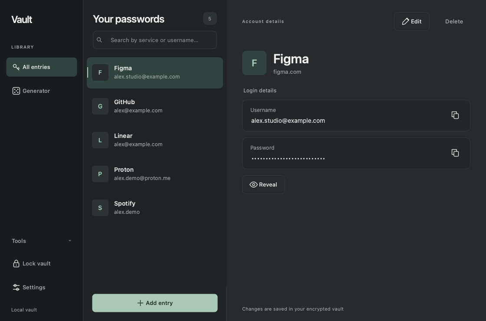
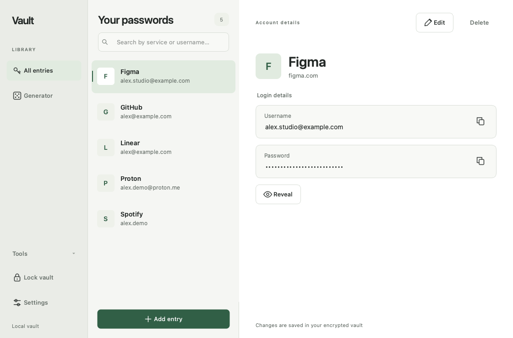
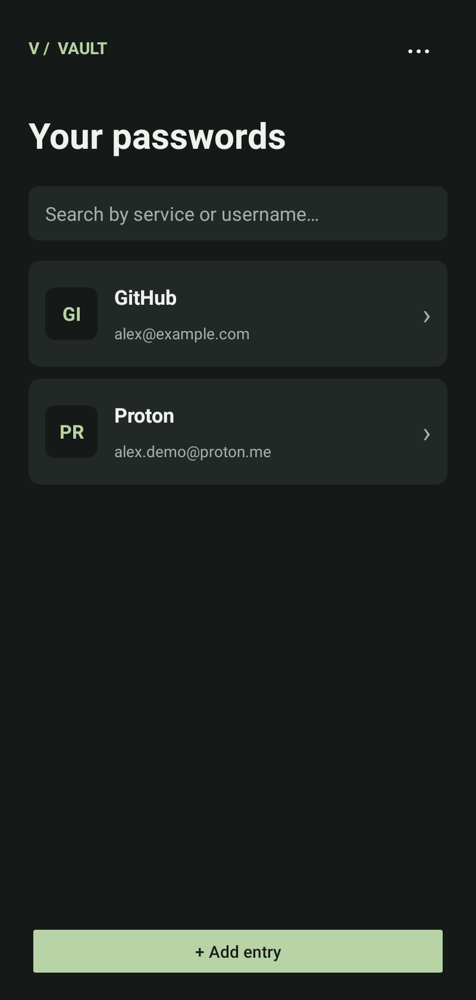

<div align="center">

<h1>Vault</h1>
<p><strong>Your passwords. Your device. Your choice.</strong></p>
<p>A quiet, local password manager for desktop and Android.</p>

[](https://github.com/NODEPY/vault/actions/workflows/build.yml)
[](LICENSE)
[](docs/RELEASE_STATUS.md)

[Install](docs/INSTALL.md) · [How it works](docs/USAGE.md) · [Security](docs/SECURITY.md) · [Test report](docs/TEST_REPORT.md) · [Українською](README.uk.md)
</div>



## A place for the important things

Save logins, find them quickly, generate passwords or passphrases, and take an encrypted backup with you. Vault keeps its credential database on your device. No account to create, subscription, telemetry, or cloud sync service.

- **Made to feel at home.** Five themes — Graphite, Paper, Dune, Pine and Ink — and English, Ukrainian, Polish, German and Spanish. English is the default.
- **One master passphrase.** Authenticated encryption protects the saved vault. Automatic locking, timed password reveal and clipboard cleanup reduce accidental exposure.
- **Chrome, with your permission.** Fill a selected login or capture a new one, then approve saving in the desktop app. Websites receive access individually; filling never submits a form.
- **Native Android companion.** Manage entries, move encrypted backups between devices and fill supported native app login forms after confirmation.
- **Portable by design.** Desktop and Android share the encrypted file format. Backup import merges entries into your current vault.

<table><tr><td width="72%"></td><td></td></tr></table>

## Get started

| Platform | Installation | Current distribution |
| --- | --- | --- |
| macOS | [Mac guide](docs/INSTALL.md#macos) | Apple Silicon build; ad-hoc signed, not notarized; source for other Macs |
| Windows | [Windows guide](docs/INSTALL.md#windows) | Source and GitHub Actions build workflow |
| Linux | [Linux guide](docs/INSTALL.md#linux) | Source and Ubuntu build workflow |
| Android 8+ | [Android guide](docs/INSTALL.md#android) | Debug-signed test APK or build from source |
| Chrome desktop | [Extension guide](docs/INSTALL.md#chrome) | Unpacked extension; desktop Vault required |

[Release assets](https://github.com/NODEPY/vault/releases) are available only when attached to a release. Successful [Actions runs](https://github.com/NODEPY/vault/actions) provide build artifacts; GitHub sign-in may be required to download them. Every platform has a source installation guide.

**This is beta software.** Real-device Android autofill and full installed-Chrome integration still need validation. Windows/Linux CI builds do not replace interactive testing on a clean machine. There is no independent security audit or store release. See the [tested scope and remaining work](docs/TEST_REPORT.md).

## Why consider trusting Vault?

Trust should come from things you can inspect:

| Property | Evidence |
| --- | --- |
| Published implementation | MIT-licensed source, tests and build workflow in this repository |
| Standard cryptographic components | Argon2id derives a key; Fernet uses AES-128-CBC + HMAC-SHA256. [Parameters and limits](docs/SECURITY.md) |
| Local storage | Encrypted credential files; Android declares no Internet permission. [Privacy](docs/PRIVACY.md) |
| Explicit browser access | Exact HTTPS origin matching, per-site permission, desktop confirmation and authenticated local relay |
| Failure handling | Tests for wrong passwords, modified ciphertext, failed writes, session locking and rejected browser requests |
| Verifiable compatibility | Python ↔ Java encrypted-file interoperability fixtures |

These are reasons to review the project, **not a guarantee of security**. Malware on an unlocked device can still read secrets. A weak master password can be guessed offline. Clipboard managers may retain copied values. Forgetting your master passphrase cannot be fixed by the developer: reset deletes the local vault and starts over. Keep encrypted backups and remember the passphrase used for each backup.

## For developers

```sh
git clone https://github.com/NODEPY/vault.git
cd vault
python3 -m venv .venv
source .venv/bin/activate
python -m pip install -r requirements.txt
python main.py
```

Windows commands are in the [installation guide](docs/INSTALL.md#windows). See [building and testing](docs/BUILDING.md) for the desktop bundle, Android project and browser fixture.

```text
core/             Models, encryption, settings and password generation
storage/          Validated, atomic encrypted persistence
ui/               PySide6 desktop UI, themes and translations
browser_bridge/   Chrome native host and authenticated local relay
extension/        Manifest V3 companion
android/          Native Java app and Autofill service
tests/            Desktop and integration checks
```

Contributions are welcome. Read [CONTRIBUTING.md](CONTRIBUTING.md), use fictional credentials in reproductions, and read the [security policy](SECURITY.md) before reporting a vulnerability.

## License

Vault's original code is licensed under [MIT](LICENSE). Third-party libraries and bundled notices retain their own licenses; see [THIRD_PARTY_NOTICES.md](THIRD_PARTY_NOTICES.md).
